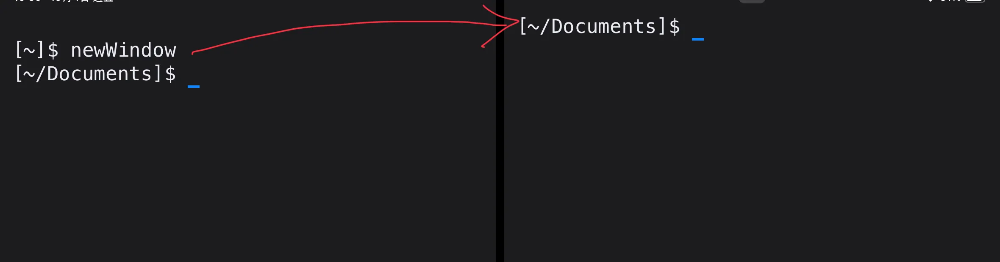
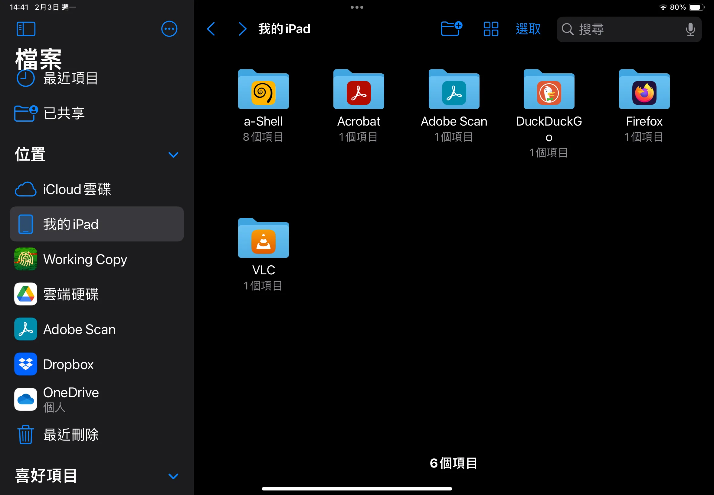

# a-shell 。在 IOS 系統開一個終端機

在使用 Apple IOS 系統中，時常會有一些用 command line 指令會更省時省力或非終端機不可的操作，使用 a-shell 這款 APP ，我們可以在手機上執行腳本、編譯、執行簡單的程式、使用 git 、vim 、甚至是遠端 ssh 到遠端主機。

a-shell 是 Nicolas Holzschuch 為 IOS 系統開發的應用程式，在 GitHub 開源，能在 APP store 直接下載，可以到 [他的 GitHub 查看 README](https://github.com/holzschu/a-shell)和[文檔](https://bianshen00009.gitbook.io/a-guide-to-a-shell)了解更詳細的使用方式。

## 操作
### 非常基本的基本指令
a-shell 就像 Linux 一樣，cd 移動目錄、mkdir 創建資料夾，創檔案 touch 、預覽 cat 通通都有，
```help -l ```會列出所有可以使用的指令，可以用管道搭配 grep 查詢指令能不能使用。
### 認識 dash 這個 shell 
a-shell 唯一且預設的 shell 叫做 ```dash``` ，可以在終端機輸入：dash 打開它。

:::tip
為了避免各位和我剛剛一樣搞不清楚狀況，我提醒一下剛打開 APP 的終端機和 shell 是兩個不同的東西，Terminal 是負責和 shell 溝通的工具，Terminal 接收指令交給 shell ，此時 shell 會去環境變數的路徑找執行檔，執行完之後把輸出純文字輸出到終端機，終端再依照設定檔把文字渲染顏色。如果沒找到指令，就會回傳 command not found 給終端機。常見的 shell 有 bash、zsh，在一般 Linux 預設的 shell 是 /bin/bash。
:::
### 設定檔
a-shell 設定檔放在 ~/Documents/.profile 和 ~/Documents/.bashrc 這兩個地方。可以在這裡設定環境變數和指令快捷鍵，對於文檔這部分的說明我還沒看很懂，總之改 .profile 就不會有留在 terminal 沒進 dash 沒讀到的問題。
### iPad 多工
- ```newWindow``` 

當滿屏的時候使用這個指令,畫面會被切一半顯示兩個終端機，兩個以上再切就會覆蓋，不能像 tmux 一直分割，要點視窗上方三個點切換。配合 slide over 滑動置前我測試最多可以叫出三個 a-shell 同時顯示。



不過我只能在 iPad 多開視窗，iPhone 不行，我猜是螢幕不夠大造成的限制。

> 把視窗最上面的三個點拖動到螢幕中間就能變成 slide over ，slide over 可以一直疊加，就像沒有 touch ID 的  Apple 一樣滑動最下方的橫桿可以切換 App


- ```exit```

 關閉視窗， 當只剩下一個視窗使用這個指令會關閉 Ａpp 回到桌面

### 特殊檔案指令

現在我們要切換試著切換目錄，每次打開 a-shell 會在 ~/Documents 目錄底下，實際上是在裝置底下 a-shell 的資料夾。


不能直接寫 Document 以上的 ```~```路徑的內容，有興趣可以 cd 過去看一下，我們安裝的套件會存在 ~/Library。

- ```pickFolder```
 
它會跳出內建的檔案管理程式要我們選擇裝置上的資料夾來掛載並移動過去。掛載後的資料夾名稱會變成 「書籤」(bookmark) ，離開該路徑之後可以使用 ```cd ~[書籤名稱]``` 或 ```jump [書籤名稱]``` 回到該掛載點。
- ```bookmark```
 
把目前所在的路徑直接變成書籤，因為只有 pickfloder 選進去的資料夾會自動變成書籤，這可以用來把掛載後的資料夾裡面的子資料夾直接變成一個可以直接前往的書籤，這時候的書籤功能就有點像是 Windows 系統中的捷徑。

- ```showmarks```

顯示所有可用的書籤

- ```deletemark```

移除書籤，可以使用 ```deletemark [書籤名稱1 書籤名稱2…]``` 或 ```deletemark -all```刪除單一、多個或所有書籤

- ```renamemark oldName newName```

重新命名書籤，就有時候打開的資料夾名稱是中文切過去要按很多鍵打字挺煩的。我還會把 a-shell 預設的 ~/Documents 路徑變成短一點的單字像是 home 。 

### 安裝套件
用 ```pkg``` 安裝其他套件。因為 a-shell 各種功能的實現都要重新編譯成 iOS 的格式，只能安裝作者提供的那些，沒有辦法像一般 Linux 那麼豐富，不過我覺得些很夠了，缺的可以看看有沒有純 Python 版本能湊合著用。

### 執行程式語言
作者的 README 寫說支援 Python, Lua, JS, C, C++ 和 TeX ，有些語言我不常寫就不一個個試了，要用的那天再來折騰。
## 應用
a-shell 可以和 Apple shortcut 一起使用，[RoutineHub](https://routinehub.co)上有不少實用的捷徑，可以上去用 APP 分類找 a-shell 能使用的捷徑，一方面觀摩其他人都用捷徑功能做什麼、怎麼做。

預設用捷徑操作 a-shell 會在 ~group 這個資料夾，不過可以用 cd 、jump 切換走，很自由的。

這就是常用的 a-shell 使用，有學到什麼新的會再補上。