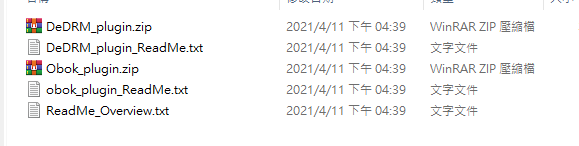
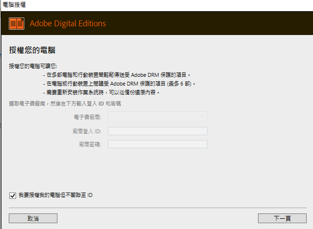
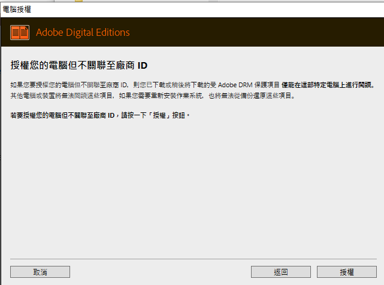
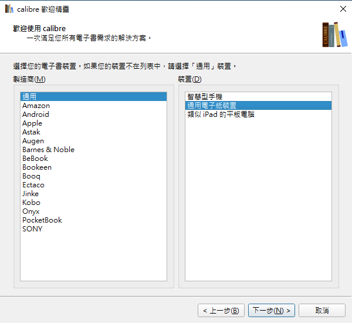
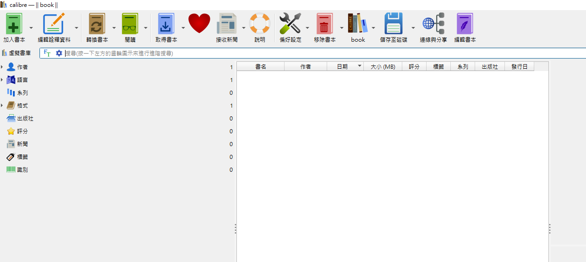
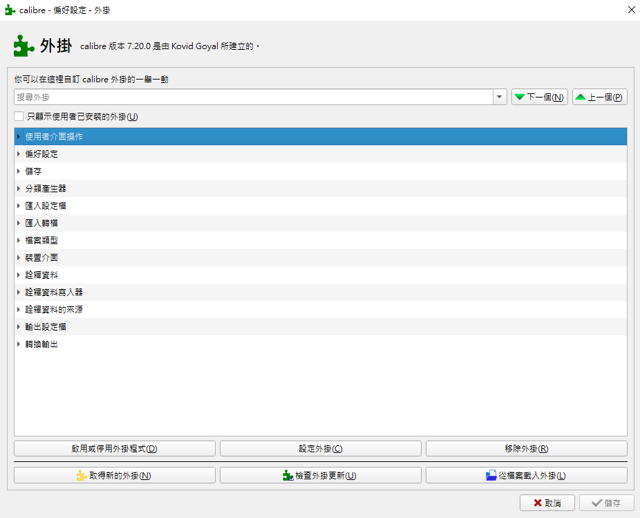
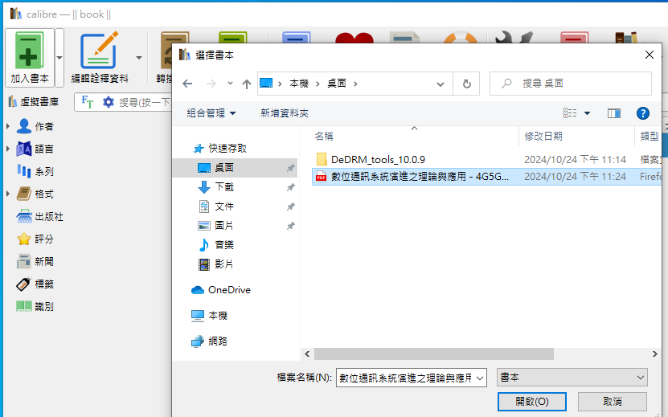

# 如何把 Google 圖書的內容以 PDF 格式下載到裝置使用

最近開始使用各大平台閱讀電子書，因為修課的緣故，我買了一本數位通信系統來好好研讀，不過我發現 Google 圖書的介面安排對喜歡在課本亂畫的人來說不太友好，一定要把一行字標上螢光筆才能添加備註，備註也不能使用筆跡添加，要用打字的，那這樣要畫一些圖就很不方便，這篇文章就要來解決這個不人性化的問題。

首先先想一下怎麼讓我的書可以讓我畫畫，在 Google book 的下載評論區要求他們改善功能肯定是不切實際的，等他們做好我都能把書抄一份在紙上了，哪還需要他們的筆記功能，所以我
首先先到 [Googl book](https://play.google.com/books) 找到你已購買要下載的書，點選 Export 匯出 PDF。

下載 [adobe edition](https://www.adobe.com/tw/solutions/ebook/digital-editions/download.html)

## 去除 DRM

### 安裝 calibre

### 安裝擴充套件
GitHub：

偏好設定>外掛>從檔案載入外掛

## 匯入書本
