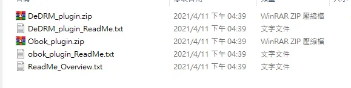
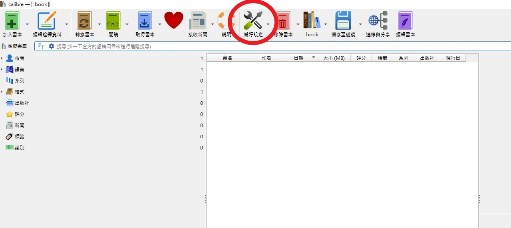
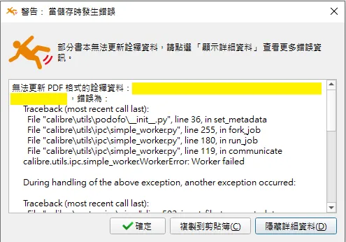

# 如何把 Google 圖書的內容以 PDF 格式下載到裝置使用

最近開始使用各大平台閱讀電子書，因為修課的緣故，我買了一本數位通信系統來好好研讀，不過我發現 Google 圖書的介面安排對喜歡在課本亂畫的人來說不太友好，一定要把一行字標上螢光筆才能添加備註，備註也不能使用筆跡添加，要用打字的，那這樣要畫一些圖就很不方便，這篇文章就要來解決這個不人性化的問題。

首先先想一下怎麼讓我的書可以讓我畫畫，在 Google book 的下載評論區要求他們改善功能肯定是不切實際的，等他們做好我都能把書抄一份在紙上了，哪還需要他們的筆記功能，所以我的策略是把書輸出成 PDF 在 iPad 裡面內建 PDF 閱讀器打開並編輯。

## 把書下載到裝置 

首先先到 [Googl book](https://play.google.com/books) 找到你已購買並且要下載的書，點選 Export 匯出 .acsm 檔案。ACSM（Adob​​e Content Server Message） 並不是書的本體，就如同它的名字，是和 Adobe 伺服器溝通的檔案，他會告訴伺服器我們要哪本書的電子檔、和伺服器索取 PDF 或 EPUB 檔案，並限定使用 Adobe Digital Editions 開啟閱讀模式。

然後去下載 [Adobe edition](https://www.adobe.com/tw/solutions/ebook/digital-editions/download.html)。它會打開 .acsm 檔案並要求綁裝置或綁定 Adobe 帳號授權讓這本書合法的被閱讀，我建議一定綁帳號，不然沒辦法跨裝置正常閱讀，萬一綁定的裝置出了問題，Google book 下載的 .acsm 沒辦法幫你重新授權，因為這個 ACSM 檔案只能授權一次，為了是避免有人把檔案分享給別人一起閱讀，如果是你自己要用但是只有綁定裝置，要寫信給 Google 要求重置啟用次數，這個之後有機會再獨立一篇出來講。

到這邊已經完成一半了，你的裝置實際上也存在電子書的 PDF 或 EPUB 版本，如果使用 Windows 系統，預設會存放在文件/My Digital Editions 這個路徑，具體取決於安裝的時候設定的路徑。但因為被下了保護，我們還是被限制在 Adobe edition 閱讀，仍然不支援在書上做標記，這不是我想要的，所以還要施一點點小魔法。

## 去除 DRM
Digital rights management，數位版權管理簡稱 DRM ，受 DRM 保護的內容只能使用限定的程式播放，這對我們的目的是一大阻礙，所以要先移除它，接下來的內容請斟酌使用，**我們是做好駭客**，請**不要**隨便把移除 DRM 的數位內容隨意公開或販售

### 安裝 calibre
Calibre 是一款免費的開源電子書管理軟體，可以用於管理、轉檔和處理各種格式的電子書。在 [Calibre 官網](https://calibre-ebook.com/zh_TW/download) 下載並安裝它，安裝也很簡單，下一步到底就可以了。

### 安裝移除 DRM 擴充套件
Calibre 本身無法直接移除 DRM，我們需要額外安裝擴充套件。我使用 DeDRM Tools。可以從[該專案的GitHub](https://github.com/noDRM/DeDRM_tools/releases)下載最新 DeDRM_tools 壓縮檔，解壓後會有兩個壓縮檔，下一步會使用到 DeDRM_plugin.zip ，其他的不會用到。

偏好設定>外掛>從檔案載入外掛>選擇 DeDRM_plugin.zip 就完成了，程式會自動把 DRM 去除

## 匯入書本

## 匯出 PDF
點選儲存至磁碟。選一個適合的資料夾放匯出的資料就大功告成了。如果沒有使用擴充套件，匯出的時候就會遇到這個失敗的提示視窗，甚至沒辦法在 Calibre 正常閱讀書本。
