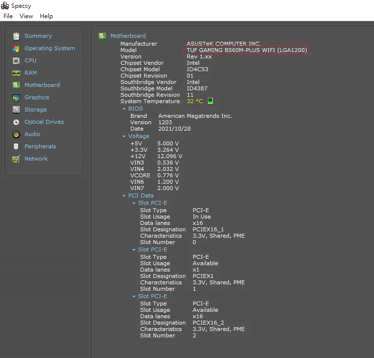
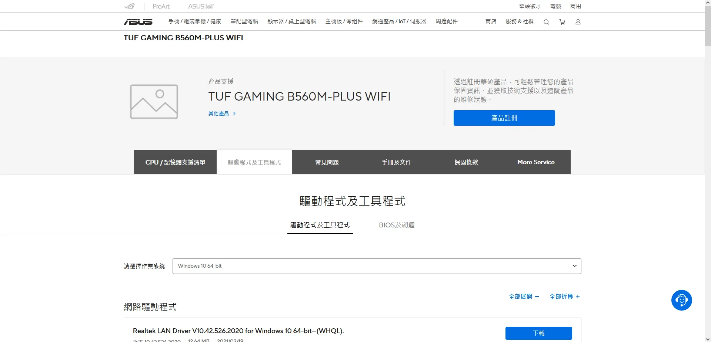
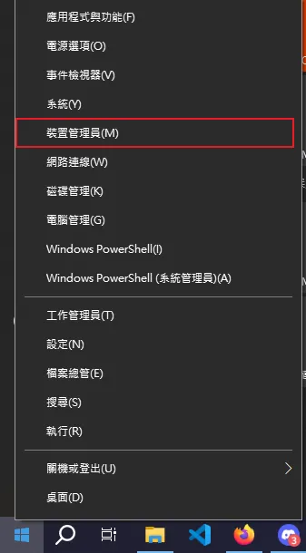
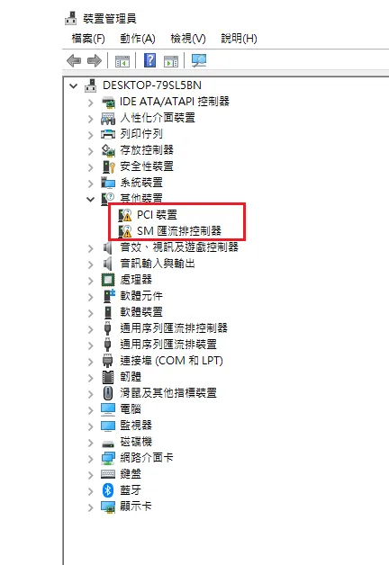
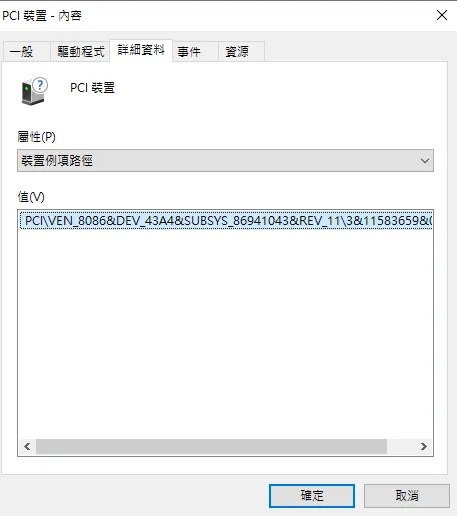
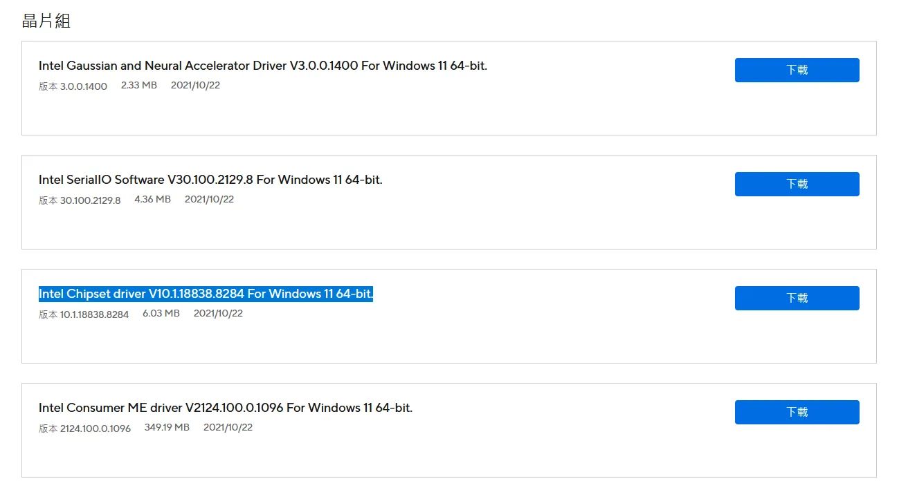
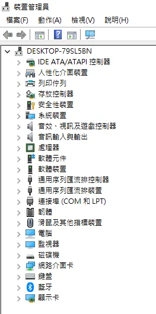

# Window系統重灌後該做的設定

最近手上幾台幾台電腦因為硬體更新原因需要重灌，有些設定步驟略為繁瑣，所以打算記一下重點做為日後參考。

## 為什麼要裝驅動程式？

重裝完作業系統後我們得到一臺”可以開機操作的電腦”，可以操作檔案、下載軟體執行等等功能，但Windows、Linux這些作業系統提供的是和電腦交互的介面，簡單說就是大框架，而一些細節則需要我們手動設定，因為各家廠商主機板設計略有不同，作業系統不見得會自動偵測主機板上的硬體設備，讓它們運作的更好，所以要下載設計者提供的驅動程式。

## 要安裝哪些驅動程式?

首先先確定要安裝哪塊主機板的驅動程式，主機板盒子、主機板上都會寫型號，也可以使用軟體偵測，如果使用Windows系統，可以下載 Speccy 這款軟體。到官網下載免費版後執行，在側邊欄位找到Motherboard，點進去在model欄位會看到主機板型號，像我的就是TUF GAMING B560M-PLUS WIFI，餵狗搜尋就會找到主機板的介紹網站了，通常也會一併看到可以下載的驅動程式，找不到可以多打關鍵字driver。

以我這款B560M為例，官網列了一堆驅動可以安裝，但不是所有東西都需要裝下來，我會裝缺少驅動就無法運作的功能和一些個人偏好工具，像B560M就有WinRAR可以裝(其實去RAR官網裝也行)，而我的筆電 Lenovo E530 就會裝 trackpoint 控制工具，用來開啟或關閉這個功能。偏好裝什麼依照個人需求和硬體設備決定。

再來打開裝置管理員查看哪些硬體需要裝驅動才能運作，在螢幕左下角右鍵打開它。

再來打開裝置管理員查看哪些硬體需要裝驅動才能運作，在螢幕左下角右鍵打開它。

到詳細資料並把屬性切換到”裝置例項路徑”，在值上右鍵複製，把VEN到DEV後面那串貼到搜尋引擎查詢，也就是查**VEN_8086&DEV_43A4**這個東西。

***VEN***是vernder(製造商代號)

***DEV***是device(設備編號)

有這兩個資訊就能知道它是什麼了

餵狗搜尋後會知道這是intel的匯流排介面，但官網上找不到43A4、PCI 等等的關鍵字，但有看到一個晶片組的驅動程式，當時我猜測應該就是這個，這就比較經驗法則了，不過若是裝錯了再執行安裝的 setup.exe 檔通常有解除安裝的選項，不用太擔心。

我載下來執行後重新開機在裝置管理員就看不到驚嘆號了!可喜可賀，收工回家

## 總結所有步驟
1.查看主機板型號

2.到裝置管理員檢查需要下載的驅動/閱讀說明書或簡介了解額外功能

3.下載並執行正確的驅動程式