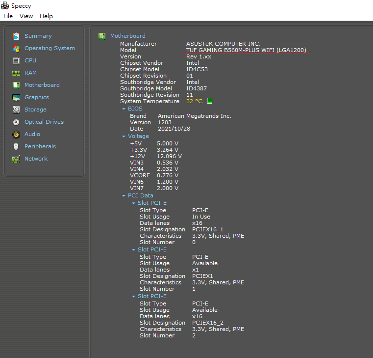

# Window系統重灌後該做的設定

最近手上幾台幾台電腦因為硬體更新原因需要重灌，有些設定步驟略為繁瑣，所以打算記一下重點做為日後參考。

## 為什麼要裝驅動程式？

重裝完作業系統後我們得到一臺”可以開機操作的電腦”，可以操作檔案、下載軟體執行等等功能，但Windows、Linux這些作業系統提供的是和電腦交互的介面，簡單說就是大框架，而一些細節則需要我們手動設定，因為各家廠商主機板設計略有不同，作業系統不見得會自動偵測主機板上的硬體設備，讓它們運作的更好，所以要下載設計者提供的驅動程式。

## 要安裝哪些驅動程式?

首先先確定要安裝哪塊主機板的驅動程式，主機板盒子、主機板上都會寫型號，也可以使用軟體偵測，如果使用Windows系統，可以下載 Speccy 這款軟體。到官網下載免費版後執行，在側邊欄位找到Motherboard，點進去在model欄位會看到主機板型號，像我的就是TUF GAMING B560M-PLUS WIFI，餵狗搜尋就會找到主機板的介紹網站了，通常也會一併看到可以下載的驅動程式，找不到可以多打關鍵字driver。

以我這款B560M為例，官網列了一堆驅動可以安裝，但不是所有東西都需要裝下來，我會裝缺少驅動就無法運作的功能和一些個人偏好工具，像B560M就有WinRAR可以裝(其實去RAR官網裝也行)，而我的筆電 Lenovo E530 就會裝 trackpoint 控制工具，用來開啟或關閉這個功能。偏好裝什麼依照個人需求和硬體設備決定。
